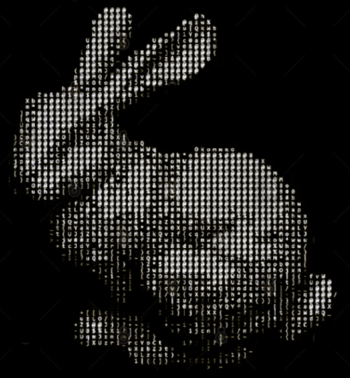

  

  

  

  

🛠️ Turning ideas into **silicon** — developing real **analog circuits**  
💻 Exploring the **digital world** — **logic**, **synthesis**, and **architecture**  
💡 Exploring new methods in **full-custom IC design** and **EDA development**

  

📜 **Languages:** SystemVerilog, Python, C/C++, MATLAB  
🧩 **Software and Tools:** Cadence Virtuoso, Cadence Tools, ModelSim, STM32CubeIDE, LTspice  
🔧 **Technical Knowledge:** Analog and digital design, full-custom ASIC design, FPGA, embedded systems

  

  
   
  <b><i>"Follow the white rabbit to discover the projects."</i></b>

  

  
  

  

[💼 LinkedIn](https://www.linkedin.com/in/murilomuller7/) •
[🔗 ORCID](https://orcid.org/0009-0000-8899-9338) •
[✉️ E-mail](mailto:murimattosmuller@gmail.com)

